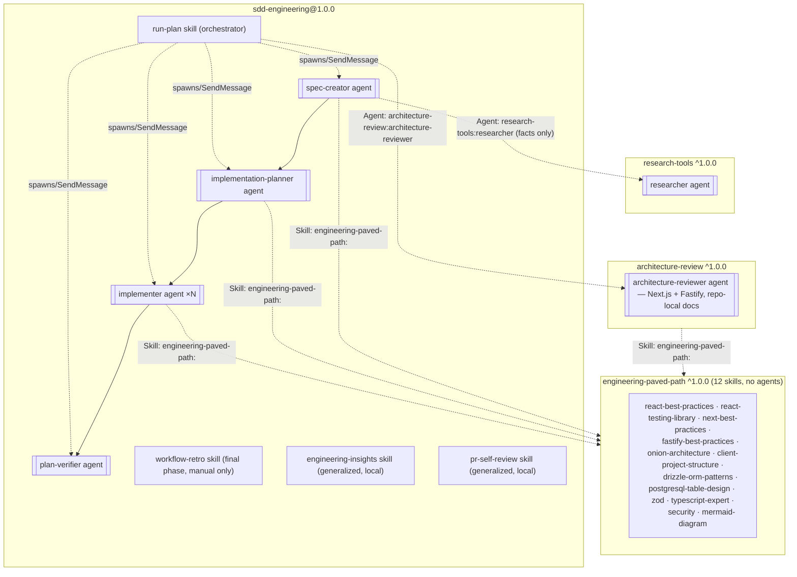

# Plugin composition: SDD Engineering + reusable plugins

This document records **how** the four previously-placeholder (`version: 0.0.0`) plugins in
this marketplace were populated with real content, and **where** that content came from. The
sole source is a private, internal Claude Code agent setup (`.claude/agents/`,
`.claude/skills/`, `.claude/hooks/`, its top-level `evals/`) from another project — not
itself part of this marketplace, and not named or path-referenced here. The job was to
extract what's reusable from it and package it as separate, self-contained plugins in this
marketplace, per [`docs/PLUGIN-GUIDELINES.md`](./PLUGIN-GUIDELINES.md).

Below is the agreed 5-step build plan, plus the decisions made while executing it. All four
plugins are now populated and pass `claude plugin validate .`.
[Items that needed a decision](#items-that-needed-a-decision) at the end records where the
plan and the repository's pre-existing conventions disagreed, and how each was resolved.

## Step 1 — source

A single donor project — a private, internal repository, referenced only as "the source
project" throughout this document. No other repository is used.

## Step 2 — sort into four groups, select components

Every file from the source project falls into exactly one of four groups:

| Group | What it is | Illustrative examples |
|---|---|---|
| **Reusable** | skills, agents, hooks, and evals **without product-specific paths** | an agent prompt, write-scope hook scripts, an agent's eval cases |
| **Project-specific** | a conventions doc, product specs, module names and rules unique to the source project | its own package names, internal class names, its own `specs/*.md` |
| **Optional integrations** | components with network access or credentials | MCP servers (if any), an API-key-dependent eval proxy |
| **Local leftovers** | cache, personal memory, experiments, absolute paths | any state file, `results/`, `node_modules/`, any local filesystem path |

**Check (Step 2):** for every file carried over, its **owner** (which plugin), **consumer
scenario** (who/what actually invokes it), and **reason** it ships together with the rest of
that plugin must all be nameable. A file that can't answer all three is a candidate for
"local leftovers," not for the release.

### First release — the exact list

| Goes into | Component |
|---|---|
| `sdd-engineering` | `spec-creator`, `implementation-planner`, `implementer`, `plan-verifier` (agents) |
| `sdd-engineering` | `run-plan`, `workflow-retro` (orchestration skills) |
| `sdd-engineering` | **`engineering-insights`, generalized** — moved here rather than into `engineering-paved-path`, because it no longer knows any source-project module names — it's a per-workflow `INSIGHTS.md` convention, not a technical best practice like `security`/`zod` |
| `sdd-engineering` | **behavior evals** — under each plugin's own `evals/`, using Claude Code's native eval format (see below), not a separate npm package |
| dependency plugins | `researcher` → `research-tools`, `architecture-reviewer` → `architecture-review` — needed by the workflow but useful standalone, so not copied into `sdd-engineering` |
| `engineering-paved-path` | technical skills — **one source**, never copy-pasted into each agent |

A documentation agent and a test-writing agent present in the source project are **not
included** in any of the four plugins (the latter was already disabled in the source; the
former is a product-specific documentation agent, out of scope for this marketplace).

## Step 3 — dependency graph

| Plugin | Supplies | Depends on |
|---|---|---|
| `engineering-paved-path` | shared technical skills (list below) | — |
| `research-tools` | read-only agent `researcher` | — |
| `architecture-review` | generalized `architecture-reviewer` | `engineering-paved-path` `^1.0.0` |
| `sdd-engineering` | 4 agents + `run-plan` + `workflow-retro` + `engineering-insights` + evals | `engineering-paved-path`, `research-tools`, `architecture-review`, all `^1.0.0` |

```
sdd-engineering@1.0.0
├── engineering-paved-path@^1.0.0
├── research-tools@^1.0.0
└── architecture-review@^1.0.0
    └── engineering-paved-path@^1.0.0      (transitive, same package — not a separate copy)
```

Release order, dictated by the transitive dependency:
`engineering-paved-path@1.0.0` → (`research-tools@1.0.0` can go in parallel) →
`architecture-review@1.0.0` → `sdd-engineering@1.0.0`.

### `engineering-paved-path` — only what's actually consumed

Rule from Step 3: **no "just in case" list** — a large list with no real consumer inflates
discovery context and support burden. Verified one by one — every entry has at least one
real consumer among `sdd-engineering`'s/`architecture-review`'s agents:

| Skill (in paved-path) | Real consumer(s) |
|---|---|
| `react-best-practices` | `implementer`, `implementation-planner` (Frontend set) |
| `react-testing-library` | `implementer`, `implementation-planner` (Frontend set) |
| `next-best-practices` | `implementer`, `implementation-planner` (Frontend set) |
| `fastify-best-practices` | `implementer`, `implementation-planner` (Backend set) |
| `onion-architecture` (part of "architecture") | `implementer`, `implementation-planner` (Backend), `architecture-reviewer` |
| `client-project-structure` (part of "architecture") | `implementer`, `implementation-planner` (Frontend), `architecture-reviewer` |
| `drizzle-orm-patterns` | `implementer`, `implementation-planner` (Backend set) |
| `postgresql-table-design` | `implementer`, `implementation-planner` (Backend set) |
| `zod` | all 4 `sdd-engineering` agents + `architecture-reviewer` (full-stack trio) |
| `typescript-expert` | all 4 `sdd-engineering` agents + `architecture-reviewer` (full-stack trio) |
| `security` | all 4 `sdd-engineering` agents + `architecture-reviewer` (full-stack trio) |
| `mermaid-diagram` | `spec-creator` (diagrams in `## Contracts & flows`) |

Nothing is dropped — every entry has a documented consumer, so the Step 3 list ("React,
testing, Next.js, Fastify, architecture, Drizzle, PostgreSQL, Zod, TypeScript, security, and
Mermaid") is **already minimal** — nothing extra needed adding.

`pr-self-review` and `engineering-insights` **do not go into `engineering-paved-path`** —
both are per-workflow (the source's "Workflow" category, not "Backend/Frontend/Full-stack"),
and `engineering-insights` is explicitly generalized and lives in `sdd-engineering` (Step 2).
`pr-self-review`'s placement was an [open item](#items-that-needed-a-decision), now resolved
— see below.

### `architecture-reviewer` — repo-local docs instead of hardcoded checks

This Step 3 clarification and an earlier user clarification reconcile as follows: the agent
**stays oriented on the Next.js + Fastify + JS/TS ecosystem** (it does not become
framework-agnostic), but stops **hardcoding** the source project's own specific paths and
names. Instead it reads the installed repository's own **repository-local architecture
docs** (a file like `ARCHITECTURE.md` / `docs/architecture.md`, which the installer writes
for their project) and applies the same Next.js/Fastify patterns (the onion dependency rule,
DI container vs `new`, the RSC boundary) against it. So "generalized" here means "doesn't
know one specific product," not "doesn't know any stack."

### Namespaced references

`Skill`/`Agent` calls into a component from another plugin always use
`<plugin-name>:<name>`: `engineering-paved-path:react-best-practices`,
`research-tools:researcher`, `architecture-review:architecture-reviewer`. Additionally:
**some manifest fields expect a plugin-scoped reference even for a component in the same
plugin** — don't assume an unprefixed name is always valid; verify the specific field's
expected format with `claude plugin validate` at build time.

### `plugin.json` — the shape of `dependencies`: an array, not a map

```json
{
  "name": "sdd-engineering",
  "version": "1.0.0",
  "dependencies": [
    { "name": "engineering-paved-path", "version": "^1.0.0" },
    { "name": "research-tools", "version": "^1.0.0" },
    { "name": "architecture-review", "version": "^1.0.0" }
  ]
}
```

`architecture-review/plugin.json` gets the same field with one entry
(`engineering-paved-path`, `^1.0.0`).

**Check (Step 3):** `claude plugin validate .` passes on all four plugins (verified — see
[item 1](#items-that-needed-a-decision) for what remains open about `dependencies` beyond
structural validation).

## Step 4 — assembling `sdd-engineering`

```
plugins/sdd-engineering/
├── .claude-plugin/
│   └── plugin.json                  # dependencies: array of three plugins, all ^1.0.0
├── skills/
│   ├── run-plan/SKILL.md             # orchestrator: executes an APPROVED plan —
│   │                                  # Mode A → implementer×N → arch-review fix-loop
│   │                                  # → Mode B → pr-self-review → human gate
│   ├── workflow-retro/
│   │   ├── SKILL.md                  # analyzes a FINISHED run (manual only,
│   │   │                              # the final/7th phase of the chain)
│   │   └── scripts/collect.mjs       # locates itself via ${CLAUDE_SKILL_DIR}
│   ├── engineering-insights/SKILL.md # generalized — no source-project modules
│   └── pr-self-review/SKILL.md       # generalized push gate, resolved here (see below)
├── evals/                            # native Claude Code eval cases — see below
├── agents/
│   ├── spec-creator.md
│   ├── implementation-planner.md
│   ├── implementer.md
│   └── plan-verifier.md
├── hooks/                            # session-wide pr-self-review push gate
├── scripts/                          # agent-scoped write-scope hook scripts
├── README.md                         # the whole workflow in one document
├── CHANGELOG.md                      # optional at plugin level (root CHANGELOG.md stays
│                                      # authoritative per docs/PLUGIN-GUIDELINES.md) — this
│                                      # plan explicitly wants both
└── COMPATIBILITY.md                  # Claude Code >= 2.1.110 — see below
```

### Editorial pass (done for every file carried over from the source project)

- Stripped paths and names that exist only in the source project (its own package names,
  internal class names, module names).
- Replaced assumptions about repo structure with **explicit inputs** (parameters/placeholders
  the installer fills in for their own project).
- Reviewed each agent's `tools:`/permissions — no permission retained that existed only for
  a source-project-specific action.
- Replaced bare local references with namespaced dependencies (`engineering-paved-path:...`,
  etc.).
- Documented in the README **where exactly** `run-plan` expects an already-written spec
  (`specs/`) and plan (`docs/plans/`) — it only reads them, never creates them.
- Described the behavior when a Task's `Verify`/test command **isn't found** in the
  installer's repository, instead of silently skipping or hardcoding a source-project script.
- `${CLAUDE_PLUGIN_ROOT}` for any plugin-level file (hooks, paths in `plugin.json`).
- `${CLAUDE_SKILL_DIR}` for supporting scripts inside a specific skill
  (`workflow-retro/scripts/collect.mjs`).
- No credentials in any manifest — not even as examples.
- Removed duplicate instructions between agent prompts and skills (the rule lives once, in
  the skill; the agent references it).

### `COMPATIBILITY.md` — new requirement from this plan

Records the minimum version: **Claude Code >= 2.1.110**, because `dependencies` with semver
ranges (Step 3) is a version-constrained capability that may not exist in an arbitrary older
CLI version. If a still-newer capability gets used later, name it separately in this file and
raise the floor per Claude Code's own documentation, not by guesswork.

This file isn't part of the current `docs/PLUGIN-GUIDELINES.md` file set (which lists only
`README.md` as required and `CHANGELOG.md` as optional) — it's an addition, not a
replacement.

**Check (Step 4):** the plugin reads no undocumented file from the source project, and has
everything it needs either inside its own directory or in a declared dependency plugin.

### Evals — Claude Code's native convention, not a separate npm package

The source project keeps its eval harness at its own repository root (a top-level `evals/`,
a sibling of `.claude/`) — a separate npm package: its own `package.json`, lockfile, ~40
dependencies, vitest, its own `src/` engine (DSL, scoring, a proxy for a non-Anthropic
backend), and cases per agent/skill (a thin runner file + a data file + fixture files).
That's a capable CI tool, but porting it 1:1 into every plugin would mean dragging a copy of
that heavy npm engine into four different plugins at once — exactly what the user asked to
avoid ("not a separate folder — inside the plugin").

Instead, this uses **Claude Code's own native eval convention**, confirmed directly against
the installed CLI (`claude plugin eval --help`, Claude Code 2.1.206):

- A case is `evals/<case-name>/prompt.md` + `evals/<case-name>/graders/criteria.md` (plus an
  optional `files/` folder for fixtures referenced from the prompt) — plain markdown, no
  code, run via `claude plugin eval`.
- `evals/` **is not one of the Claude Code directories a plugin's loader recognizes**
  (`agents/`, `skills/`, `commands/`, `hooks/`). An installer never reads it — it ships in git
  with the plugin, versions with the same release, but is never executed and never costs the
  end user any tokens. That is what "convenient to grade, not a separate folder" means in
  practice: maintainer tooling lives next to the code it checks.
- **Agents** (`agents/*.md`) are files, not directories, so there's nowhere to nest an
  `evals/` folder "inside" one the way a skill can. Practical resolution: the same
  plugin-root `evals/<agent-name>/...` shape, mirroring `agents/*.md` — no special case
  needed since the native convention already globs `evals/**` from the plugin root.
- Real, previously-validated cases for `architecture-reviewer` (fabrication-pressure and
  rule-citation checks) existed in the source project's own eval harness — carried over as
  two `prompt.md`/`graders/criteria.md` cases with their diff fixtures, rather than written
  from scratch. For `spec-creator`/`implementation-planner`/`implementer`/`plan-verifier`/the
  `sdd-engineering` skills, no ready-made set existed in the source — one representative case
  per component was authored for this release.
- `claude plugin eval` reported itself as **early access** at authoring time on Claude Code
  2.1.206 — the case files are written and ready, but actually running them requires whatever
  opt-in that feature currently needs. Recorded in each plugin's `COMPATIBILITY.md`.

(An earlier draft of this plan assumed a different, `evals.json`-based format based on
secondhand research about a different plugin's own tooling. That format does not match what
`claude plugin eval --help` actually documents on the installed CLI, so it was replaced.)

## Step 5 — registering the plugins in the marketplace

```json
{
  "$schema": "https://json.schemastore.org/claude-code-marketplace.json",
  "name": "dev-digest-ai-marketplace",
  "owner": { "name": "IlyaKuzich", "email": "ilakuzich@gmail.com" },
  "plugins": [
    { "name": "engineering-paved-path", "source": "./plugins/engineering-paved-path", "...": "displayName/description/version also present — see below" },
    { "name": "research-tools", "source": "./plugins/research-tools" },
    { "name": "architecture-review", "source": "./plugins/architecture-review" },
    { "name": "sdd-engineering", "source": "./plugins/sdd-engineering" }
  ]
}
```

Principle: don't duplicate `version`/component definitions between `plugin.json` and its
marketplace entry without a reason — `plugin.json` stays the source of truth for a plugin's
composition, and `marketplace.json` mainly points at `source` and catalog metadata.

**Resolved:** this repository's `marketplace.json` already carried richer entries
(`displayName`, `description`, `version` per plugin) before this work started, consistent
with `docs/SITE-SPEC.md` — the site's `index.json` build still reads those fields from each
plugin's own `plugin.json`, not from `marketplace.json`, so the richer entries here are
purely a `/plugin marketplace add` UX convenience before install, not a second source of
truth. Kept as-is; only the `$schema` field and the placeholder `description`/`version`
values were updated to match the real, now-populated plugins. The real `owner`
(`IlyaKuzich` / `ilakuzich@gmail.com`) was kept rather than the plan's illustrative
`{ "name": "AI Engineering" }` example.

**Check (Step 5):** `claude plugin validate .` sees all four plugins and their manifest
`name`s match the marketplace entries — confirmed.

## Four plugins and the boundary between them — summary

| Plugin | Type | Contains | Depends on |
|---|---|---|---|
| **engineering-paved-path** | shared skills, no agents | 12 technical skills (table above) | — |
| **research-tools** | dependency plugin | agent `researcher` | — |
| **architecture-review** | dependency plugin | agent `architecture-reviewer` (Next.js/Fastify, repo-local docs) | `engineering-paved-path` `^1.0.0` |
| **sdd-engineering** | SDD pipeline | 4 agents, `run-plan`, `workflow-retro`, `engineering-insights`, `pr-self-review`, evals | all three above, `^1.0.0` |

The marketplace's rule — **no cross-plugin file reads** — is not broken for **runtime**
content: every plugin is self-contained, and a namespaced `Skill`/`Agent` call by plugin name
is not a file access. `docs/PLUGIN-GUIDELINES.md` already describes this exact scenario as
"No implicit runtime dependencies" — allowed, documented under `## Requires` in each README,
and now also recorded structurally in `plugin.json`'s `dependencies`.



## 1. `sdd-engineering` — details

### Agents (mapping to source, with the key traits that must be preserved)

| Plugin name | Source | Model | Write scope | Role in the chain |
|---|---|---|---|---|
| `spec-creator` | `spec-creator.md` | opus | Only `specs/**` — enforced by a **hook in the agent's own frontmatter** (`PreToolUse: Write\|Edit`), not `Bash` | WHAT & WHY. EARS criteria (`AC-N`), a 6-category interview, `Status: draft` — never sets `approved` itself |
| `implementation-planner` | `implementation-planner.md` | opus | Only `docs/plans/**` — same hook mechanism | Requirements review + a multi-agent/single-agent question → task contracts with `Owns/Verify/Skills to invoke` |
| `implementer` | `implementer.md` | sonnet | Files its task owns (file ownership, no worktree isolation) | Executes 1 task, self-verifies via its Verify command, appends to `INSIGHTS.md` |
| `plan-verifier` | `plan-verifier.md` | sonnet, `permissionMode: plan` (read-only) | Writes nothing | Two modes: **Mode A** (spec⇄plan gate, no code) and **Mode B** (full `AC-N → Task → code → test` trace) |

The mechanics that had to be preserved exactly, not just in spirit:
- **Hook-enforced write scope** in each write-agent's own frontmatter (`spec-creator`,
  `implementation-planner`) — not a session-wide `permissions.deny`, which would also block
  `implementer`.
- **`AC-N` IDs are immutable.** Changing a requirement after `approved` means a new spec with
  `Supersedes:`, never an edit in place.
- **Only a human flips `draft → approved`.** `spec-creator` says so explicitly in its report
  and never raises the status itself.
- **`plan-verifier` Mode A runs BEFORE any code is written**, Mode B after. The order is
  load-bearing — see the plugin's own README for why.

### Skills

| Plugin name | Source | What it does |
|---|---|---|
| `run-plan` | `implement/SKILL.md` (renamed) | Orchestrates an **already-ready** spec+plan: Mode A gate → N×`implementer` → `architecture-review:architecture-reviewer` with a bounded fix loop → Mode B → `pr-self-review` → human gate before push/PR. **Never preloaded** into any agent — it's an orchestration skill, not a practice |
| `workflow-retro` | `workflow-retro/SKILL.md` | **Manual-only** (`/workflow-retro`), the final (7th) phase of the chain — run by a human **separately from** `run-plan`, after a run has already finished. Reads the run's **own transcripts** (`scripts/collect.mjs`, locating itself via `${CLAUDE_SKILL_DIR}`), computes exact tokens/cost/roster/warm-vs-cold reuse, judges the run against the README's rules, writes a report to `docs/agent-runs/`. Grades the **process**, not the code |
| `engineering-insights` | `engineering-insights/SKILL.md`, generalized | Append-only `INSIGHTS.md` convention, no source-project modules. Now **local** to `sdd-engineering` (not namespaced), since this is where `implementer` actually consumes it |
| `pr-self-review` | `pr-self-review/SKILL.md`, generalized | Resolved to live here (see [item 4](#items-that-needed-a-decision)) — the pre-push diff gate `run-plan` calls at its final phase, with its push-gate hook wired via `hooks/hooks.json` |

### Namespaced cross-plugin calls (hard rule from Step 4)

Inside `sdd-engineering`, **any** reference to a skill/agent from another plugin uses
`<plugin-name>:<name>`, never a bare name:

```yaml
# in implementer.md's frontmatter
skills:
  - engineering-paved-path:react-best-practices
  - engineering-paved-path:security
  - engineering-paved-path:typescript-expert
```

```markdown
<!-- inside run-plan/SKILL.md -->
Spawn `architecture-review:architecture-reviewer` on the diff.
Invoke the `pr-self-review` skill before the final gate.
```

This is the mechanism that turns a documented `## Requires` dependency in a README into
something that actually executes, rather than staying prose.

### README.md — contents (how it all works together)

Structure (modeled on the source project's own agents-README, condensed to plugin-README
size):

1. **Catalog** — agent/skill → model → write scope → purpose table (as above).
2. **Requires** — `engineering-paved-path ^1.0.0`, `research-tools ^1.0.0`,
   `architecture-review ^1.0.0` — matching `plugin.json`'s `dependencies` versions exactly.
   States plainly: "without them, the corresponding `run-plan` steps are skipped with a
   warning" — not a hard failure.
3. **Chain diagram** — mermaid: `research-tools:researcher (optional) → spec-creator →
   implementation-planner → plan-verifier(Mode A) → implementer×N →
   architecture-review:architecture-reviewer → plan-verifier(Mode B) → pr-self-review →
   a human → push`.
4. **Why this order** — the two non-obvious decisions from the source, kept:
   - `plan-verifier` runs twice (Mode A is cheap and catches the most expensive defect — a
     forgotten AC — before anyone writes code).
   - `architecture-reviewer` runs before tests are written, not after (an architecture fix
     invalidates a test written against the old shape).
5. **Fix-loop table** — who fixes, who re-checks, bound = 2 attempts → escalate to the user.
6. **Four enforcement points** of the spec→plan→code chain (question→guess,
   draft→approved, draft→plan, plan→code, code→merge).
7. **Insights** — `implementer` writes to the module-local `INSIGHTS.md`; `spec-creator`/
   `implementation-planner` write to none (`no write access`) and surface a lesson in their
   report instead.
8. **Orchestrating economically** — warm `SendMessage` instead of cold-spawn, small work done
   inline, terse reports.
9. **Cost note** — points at this marketplace's `docs/COST-BASELINE.md` (not a plugin-local
   file — tracked centrally per the plugin guidelines).

### Versioning / releases

- `plugins/sdd-engineering/.claude-plugin/plugin.json` → `version` (SemVer) + `dependencies`
  (array of three plugins, all `^1.0.0`).
- `plugins/sdd-engineering/CHANGELOG.md` — an optional plugin-level log (Step 4 explicitly
  wants one in addition to the root one).
- The root `CHANGELOG.md` stays authoritative for `scripts/release.sh`.
- `docs/RELEASES.md` already describes the whole release/rollback/pinning workflow, unchanged.

Since `sdd-engineering` depends on `^1.0.0` of three plugins, those three need their first
`1.0.0` release **before** `sdd-engineering`'s first real release.

## 2. `research-tools`

```
plugins/research-tools/
├── .claude-plugin/plugin.json
├── agents/researcher.md
└── README.md
```

`researcher.md` was carried over nearly unchanged — it was already product-agnostic:
read-only (`Read, Grep, Glob, Bash, WebSearch, WebFetch`), two scopes (codebase/web), a
strict report format (`FOUND/PARTIAL/NOT_FOUND`), "an honest not-found is a valid result."
The only cleanup needed was replacing source-project-specific path examples in the prompt
text with generic ones.

README: no `## Requires` section (a leaf, independent agent; `sdd-engineering` depends on it,
not the other way around).

## 3. `architecture-review`

```
plugins/architecture-review/
├── .claude-plugin/plugin.json        # dependencies: [{ "name": "engineering-paved-path", "version": "^1.0.0" }]
├── agents/architecture-reviewer.md   # Next.js + Fastify + JS/TS ecosystem, repo-local docs
├── evals/                            # two native prompt.md/graders/criteria.md cases,
│                                      # carried over from the source's own eval cases
│                                      # (fabrication-pressure and rule-citation checks)
├── COMPATIBILITY.md
└── README.md
```

The source already had real, non-trivial eval cases here (not stubs — cases verified once
against a "relaxed" agent snapshot to confirm they actually discriminate prompt quality: does
the agent cite the exact rule identifier, does it avoid inventing a finding on a benign
diff). Those were kept, converted to the native eval format, rather than written from
scratch.

**Resolved: no deep generalization.** This iteration is training on building a marketplace
and plugins, not an exercise in abstracting architectural principles. So `architecture-reviewer`
**stays oriented on the Next.js + Fastify + broader JS/TS ecosystem** (React, Drizzle/Postgres)
— the exact stack the source agent was written for — and "generalized" from Step 3 means:

- Removing the source project's own proper nouns (its DI-container type name, its secrets
  abstraction name, its own module names) — specific to one product, not to Next.js/Fastify
  in general.
- Replacing hardcoded checks against the source project's own paths with **reading the
  installer's own repository-local architecture docs** (Step 3), and applying the same
  Next.js/Fastify patterns against them.
- Keeping the **concrete, stack-specific** rules as-is: the onion dependency rule for
  Fastify services, DI container vs `new`, the Next.js App Router RSC boundary,
  repository/DTO boundaries for Drizzle+Postgres.
- Not abstracting into framework-agnostic language.

Unchanged from the source:
- Read-only (`permissionMode: plan`, no `Edit`/`Write`).
- Exactly 3 severities: `CRITICAL | WARNING | SUGGESTION`, verdict is a pure function of
  findings.
- An empty findings list ⇒ `approve` (never pad findings to look thorough).
- Boundary with `pr-self-review`: never duplicate its mechanical grep checks — semantic
  judgment only.

README: `## Requires` — `engineering-paved-path ^1.0.0` (for `onion-architecture`,
`client-project-structure`, `typescript-expert`, `security`, which the agent preloads).

## 4. `engineering-paved-path` — shared (reusable) skills

No agents, only `skills/`. Exactly 12 entries, each with a documented consumer (table in
Step 3), **not** a "full set just in case."

```
plugins/engineering-paved-path/
├── .claude-plugin/plugin.json
├── skills/
│   ├── security/SKILL.md
│   ├── zod/SKILL.md
│   ├── typescript-expert/SKILL.md
│   ├── mermaid-diagram/SKILL.md
│   ├── react-best-practices/SKILL.md
│   ├── react-testing-library/SKILL.md
│   ├── next-best-practices/SKILL.md
│   ├── fastify-best-practices/SKILL.md
│   ├── onion-architecture/SKILL.md
│   ├── drizzle-orm-patterns/SKILL.md
│   ├── postgresql-table-design/SKILL.md
│   └── client-project-structure/SKILL.md
└── README.md                             # skill catalog with a Scope column — the source
                                            # of truth for the skill→area map that
                                            # sdd-engineering reads by namespaced name
```

`engineering-insights` and `pr-self-review` are **excluded from here** (moved to
`sdd-engineering` — see Step 3 and [item 4](#items-that-needed-a-decision)) — there is no
`hooks/` directory here either, since `pr-self-review`'s push-gate hook lives with the skill.

README: no `## Requires`. This is the plugin **others** reference.

## Cross-plugin dependency: how it's documented (template)

In every README of a plugin that needs another:

```markdown
## Requires

- `engineering-paved-path` (^1.0.0) — this plugin invokes its skills by namespaced reference
  (`engineering-paved-path:security`, `engineering-paved-path:zod`, …) via Claude Code's
  `Skill` mechanism; it is not part of this plugin and must be installed separately. If not
  installed: the call silently fails to resolve the skill — the agent continues, just without
  that practice applied.
```

Plus the same version constraint, structured, as an array, in `plugin.json` (the shape from
Step 3). This is an **informational** field until confirmed otherwise (see item 1 below) — it
never replaces the README's `## Requires` prose; it just duplicates the version contract in a
machine-readable form next to the code.

## Naming (as spoken in the request → technical name)

| As the user said it | Technical name |
|---|---|
| Specreator | `spec-creator` |
| Implementation Planner | `implementation-planner` |
| Implementer | `implementer` |
| Plan Verifier | `plan-verifier` |
| Run | `run-plan` skill (renamed from `implement`) |
| workflow retro | `workflow-retro` skill — the final (7th) phase of the chain, manual only |
| Research Tools / Researcher | plugin `research-tools`, agent `researcher` |
| Architecture Reviewer | plugin `architecture-review`, agent `architecture-reviewer` (generalized) |

## Items that needed a decision

Gaps between the plan and the repository's prior state — resolved during implementation:

1. **`claude plugin list --json` and dependency status reporting.** The plan (Steps 3/5)
   assumed the CLI would report `dependency-unsatisfied`/`range-conflict`/`no-matching-tag`.
   This repository's own [`docs/PLUGIN-GUIDELINES.md`](./PLUGIN-GUIDELINES.md) and
   [`docs/RELEASES.md`](./RELEASES.md) state that the Claude Code plugin system has **no**
   dependency-resolution field — `dependencies` is treated as informational.
   **Verified against the installed CLI** (Claude Code 2.1.206): `claude plugin validate .`
   passes structurally; a related, closer subsystem (`claude plugin eval`) reported itself as
   early-access, so a live dependency-resolution check couldn't be exercised either way. Each
   affected plugin's `COMPATIBILITY.md` records this honestly as unresolved rather than
   assuming either answer.
2. **`marketplace.json` — minimal entries vs. the existing, richer ones.** Resolved: kept
   this repository's existing richer entries (`displayName`, `description`, `version` per
   plugin), consistent with `docs/SITE-SPEC.md` (the site reads those fields from each
   plugin's own `plugin.json` regardless, so the marketplace-level copies are purely
   pre-install UX, not a second source of truth). Only placeholder text was updated to match
   the now-real plugins, plus `$schema` was added.
3. **`owner`.** Resolved: kept the repository's real owner (`IlyaKuzich` /
   `ilakuzich@gmail.com`) rather than the plan's illustrative `{ "name": "AI Engineering" }`.
4. **`pr-self-review` — where does it live?** Resolved: `sdd-engineering/skills/pr-self-review/`,
   generalized the same way as `engineering-insights` (same "Workflow" category, same
   module-name-removal treatment), with its push-gate hook (`pr-self-review-gate.sh` +
   `pr-review-diff-hash.sh`) under `sdd-engineering/hooks/`, wired via `${CLAUDE_PLUGIN_ROOT}`.
5. **Evals format.** Resolved by direct verification against the installed CLI — see the
   "Evals" section under Step 4 above. The earlier `evals.json`-based assumption was replaced
   with Claude Code's native `prompt.md` + `graders/criteria.md` convention.
6. **`docs/COST-BASELINE.md`** — still open, naturally: it gets filled in with real numbers
   (model + rough token order-of-magnitude per typical run) once these agents have actually
   been run a few times. Required by the `PLUGIN-GUIDELINES.md` checklist, not separate work.
