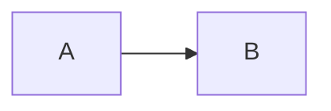

# Mermaid Diagram Creator

Generate Mermaid diagrams embedded in markdown that **communicate clearly** — showing
relationships, flows, and structure that words alone can't express.

## Core Philosophy

- **Diagrams should clarify, not decorate** — every element must serve a purpose.
- **Text-first** — Mermaid is text-based, version-controllable, and diff-friendly.
- **Right diagram for the job** — pick the type that matches the concept (see below).
- **Validate before sharing** — test in the [Mermaid Live Editor](https://mermaid.live/) or
  render locally with `mmdc`.

## Diagram Type Decision Guide

| You want to show... | Use | Mermaid keyword |
|---------------------|-----|-----------------|
| Steps, decisions, branches | **Flowchart** | `flowchart TD` |
| API calls between services over time | **Sequence Diagram** | `sequenceDiagram` |
| Object relationships, inheritance | **Class Diagram** | `classDiagram` |
| Database tables and relationships | **ER Diagram** | `erDiagram` |
| Transitions between states | **State Diagram** | `stateDiagram-v2` |
| Project timeline, task dependencies | **Gantt Chart** | `gantt` |
| Proportions, distribution | **Pie Chart** | `pie` |
| Hierarchical idea breakdown | **Mindmap** | `mindmap` |
| Git branching strategy | **Git Graph** | `gitGraph` |
| User experience steps | **User Journey** | `journey` |
| Chronological events | **Timeline** | `timeline` |

## Flowcharts

The most common diagram type — workflows, decision trees, process flows.

**Direction**: `TD`/`TB` top→down, `LR` left→right, `BT` bottom→top, `RL` right→left.

**Node shapes**: `[text]` rectangle (process), `(text)` rounded (start/end), `{text}`
diamond (decision), `((text))` circle (event/trigger), `[(text)]` cylinder (database),
`[[text]]` subroutine (external process).

**Arrows**: `-->` solid, `-.->` dashed, `==>` bold, `--text-->` labeled, `~~~` invisible
(layout only).

**Subgraphs** group related nodes into a labeled container:
```
subgraph Title
  direction LR
  A --> B
end
```

## Sequence Diagrams

Use for API flows, service interactions, request/response patterns.

| Element | Syntax |
|---------|--------|
| Solid arrow (request) | `->>` |
| Dashed arrow (response) | `-->>` |
| Note | `Note right of A: text` |
| Activation | `activate A` / `deactivate A` |
| Alt/else | `alt condition` / `else` / `end` |
| Loop | `loop label` / `end` |
| Opt (optional) | `opt condition` / `end` |

## Class Diagrams

Use for data models and object relationships.

| Syntax | Meaning |
|--------|---------|
| `<\|--` | Inheritance |
| `*--` | Composition (strong ownership) |
| `o--` | Aggregation (weak ownership) |
| `-->` | Association |
| `<\|..` | Interface implementation |
| `..>` | Dependency |

```
class ClassName {
  +String publicField
  -Number privateField
  +methodName() ReturnType
}
```

## ER Diagrams

Use for database schema relationships.

| Syntax | Meaning |
|--------|---------|
| `\|\|--\|\|` | One-to-one |
| `\|\|--o{` | One-to-many |
| `}o--o{` | Many-to-many |
| `\|\|--o\|` | One-to-zero-or-one |

```
ENTITY {
  string fieldName PK "Primary Key"
  string otherField FK "Foreign Key"
  number numericField
  date dateField
}
```

## State Diagrams

Use for component lifecycle, auth flows, or any finite state machine.

`[*] --> State1` (start), `State1 --> [*]` (end), `State1 --> State2 : event`
(transition), `state StateName { ... }` (composite state).

## Gantt Charts

```
gantt
  dateFormat YYYY-MM-DD
  title Project Timeline
  section Phase 1
    Task A :a1, 2024-01-01, 5d
    Task B :after a1, 3d
  section Phase 2
    Task C :2024-01-10, 7d
```
Durations: `1d`/`1w`/`1h`. Dependencies: `after taskId`.

## Styling and Theming

```
style nodeId fill:#f9f,stroke:#333,stroke-width:2px
classDef className fill:#bbf,stroke:#333
class nodeId className
```
```
%%{init: {'theme': 'base', 'themeVariables': {'primaryColor': '#ff6b6b'}}}%%
```
Themes: `default`, `dark`, `forest`, `neutral`, `base` (customizable).

## Best Practices

**Do**: pick the right direction (LR for timelines/flows, TD for hierarchies/decisions);
label every edge — an unlabeled arrow forces the reader to guess the relationship; use
subgraphs to reduce visual complexity; keep node labels short; use consistent naming
(camelCase IDs, readable text labels); validate syntax before committing; wrap in
` ```mermaid ` code blocks.

**Don't**: exceed ~20 nodes per diagram — split into multiple diagrams instead; use a
flowchart where a sequence diagram fits better (API flows); mix directions within one
flowchart; hardcode colors unless necessary; reach for invisible links (`~~~`) before fixing
the layout with direction/grouping.

## Rendering

GitHub, GitLab, Notion, and most markdown renderers support mermaid blocks natively:

````

````

CLI rendering with Mermaid CLI (`mmdc`), if available:
```bash
mmdc -i diagram.md -o diagram.svg -t dark
```

## Validation

Before sharing any diagram: check syntax in the Mermaid Live Editor, verify every arrow
connects to a valid node id, ensure labels are readable at the rendered size, test with the
intended theme (light/dark).
